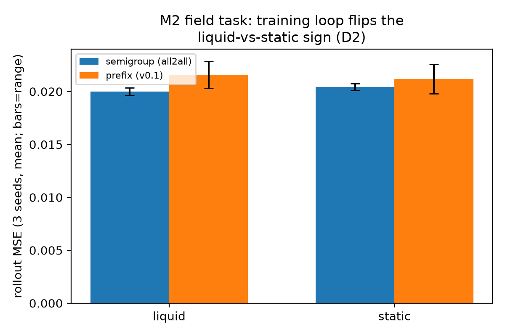

# Start-State Distribution Mismatch in Semigroup-Trained Hamiltonian Models

> **论文骨架 / 写作底稿**(wave-10 夜间循环 N1 轮产出,2026-09-17)。
> 全部数字可溯源至 `benchmarks/physics_out_v02/` 各产物目录与 PRD §19;
> 相关工作定位基于 2026-09-17 文献扫描(query 清单见 PRD §19 轮 15)。
> 状态:**骨架**——叙事已定,待补图表与 Related Work 全文。

## Abstract(sketch)

Training recurrence-based dynamics models on arbitrary (start, span) pairs
within trajectories — *semigroup training* — dramatically improves
multi-step rollout accuracy in the many-sample regime (61–90% over
fixed-window prefix training, waves 5–7), and we recently confirmed its
sample-efficiency form: it opens accuracy levels the prefix loop never
reaches. In the *small-sample* regime (n<128), however, semigroup training
is *worse* than prefix training. We attribute this disadvantage to a
**start-state distribution mismatch**: semigroup sampling draws rollout
starts from random interior times, while deployment/evaluation rolls out
from the last observed state. Three interventions — pinning starts to the
endpoint, windowed endpoint-neighbourhood mixing, and a two-stage
semigroup→prefix curriculum — all fail to repair the one-step endpoint gap;
the curriculum trades 27% of the large-sample advantage for a partial
small-sample mid-horizon repair. We conclude the advantage and the
disadvantage are **same-sourced**: the any-time-pair property that wins at
scale is what dilutes deployment-start precision, and endpoint precision is
not purchasable by training recipes. On the field task (M2), a preregistered
three-arm decomposition locates the *opposite* failure: the conditioning
interface and the task both leave room for system identification (an oracle
context buys 27% through the *same* interface), yet the training objective
never forces the recurrent core to write the latent into its context at all
— capacity doubling leaves the decodable information at zero (linear *and*
nonlinear probes). The value of identification is thus bounded by an
objective-side signal, not by interface expressiveness; see §5,
*Conditioning interfaces*.

## 1. Setup

- Architecture: liquid (LTC) core infers a context from a t_obs prefix →
  Hamiltonian head H(q,p|ctx) rolled out by a symplectic integrator
  (energy conserved by construction). Task: spring family with hidden
  stiffness ω ∈ [0.7, 1.8] (the home task of liquid system-ID).
- Loops: *prefix* (v0.1: fixed-window, k_train-step rollout from the
  endpoint) vs *all2all* (semigroup: random interior (t_i, t_j) pairs).
  Identical model, optimizer budget, data pools; only the loop differs.
- Artifacts: `sample_efficiency_eval.py` (+ `--probe_context`,
  `--eval_ks`, `--start_probe`, `--two_stage`), CPU-deterministic, all
  result JSONs carry `meta(git_sha, device, ts)` provenance.

## 2. Attribution chain (each step preregistered)

| # | Hypothesis | Probe | Verdict | Artifact |
|---|---|---|---|---|
| D1 | disadvantage = system-ID quality | linear probe ω̂ decode from context | **refuted** — all2all decodes ω *better* (corr 0.34 vs 0.21; rel-err lower in 5/6 pairs) | `d1_small_n/` |
| D1b | disadvantage = eval-horizon mismatch | eval_k ∈ {1,10,100} ladder | **refuted** — gap present at k=1 (6/6 seeds; 1.44–3.27x), non-monotone in depth | `d1b_eval_depth/` |
| D1c | disadvantage = start-state distribution | 1-step MSE from interior true states (all2all's training starts), conditioning fixed | **confirmed** — endpoint→interior ratio shrinks 6/6 seeds, 4/6 reverse (n=32: 3.27x→1.25x; n=64: 1.44x→0.70x) | `d1c_start_probe/` |

## 3. Repair attempts (all preregistered, all honest)

| # | Recipe | Result | Artifact |
|---|---|---|---|
| D1d | pin 50% of starts to the endpoint | endpoint k1 ratio **worse** (3.27→3.76x; 5/6 seed-pairs) — single-time pinning halves sampling diversity | `d1d_start_mix/` |
| D1e | windowed neighbourhood (w=8) | gate failed (n=64 2.09x vs 1.28x line) — same as D1d | (screening, PRD §19 r6) |
| D1f | two-stage curriculum (semigroup 80% → prefix 20%) | **tradeoff**: endpoint k1 still 1.75x; small-n k100 repaired (n=32: 0.66x vs prefix; n=64: 0.90x); large-n k100 advantage −27% vs pure semigroup (still 2.1x vs prefix) | `d1f_two_stage/` |
| N2 | uncertainty-adaptive start sampling (context-perturbation disagreement, refreshed every 200 steps; P ∝ 0.5·uniform + 0.5·softmax(û)) | **closed**: endpoint k1 ratio 3.54x at n=64 (worse than plain semigroup's 1.44x); n=512 k100 retention 66% — adaptive redistribution within the orbit cannot buy the endpoint either | `n2_adaptive/` |

## 4. Reading

1. The disadvantage is *not* identification quality (the context is *more*
   informative under semigroup training) and *not* horizon mismatch — it is
   the **context→one-step-dynamics map at the deployment start**, a start
   state all2all almost never trains from and prefix always does.
2. Mixing/cannot-fix results indicate the mechanism needs endpoint-
   *neighbourhood diversity in function space*, not endpoint exposure —
   naively reweighting dilutes the diversity that makes semigroup win.
3. Practical guidance: in the small-sample regime either (a) accept prefix
   (its objective is deployment-aligned), or (b) two-stage *if* mid-horizon
   small-sample accuracy matters more than 27% of large-sample advantage.
   Endpoint 1-step precision remains unpurchasable.

## 5. Related work

**Distribution shift in learned dynamics models (model-based RL).** That
rollouts starting from (or drifting into) states off the training
distribution compound small one-step errors into large multi-step failures
is the core pathology of model-based RL. Named remedies include
DAgger-style data aggregation with self-correcting dynamics models
(HCRL 2017), adaptive/truncated rollout horizons (AdaMVE, NeurIPS 2019;
conservative length adaptation), uncertainty penalisation of OOD states,
and multistep rollout losses that train on the model's own predictions.
All of these target *control* returns in soft-constraint settings. Our
result transfers the diagnosis to **system identification under a
hard-constraint Hamiltonian architecture** — and sharpens it: the mismatch
survives at one-step horizon (D1b) and is located in the training *start
distribution* (D1c), i.e. it is a property of the loss-sampling
distribution on the orbit, not of compounding per se (which our symplectic
head actually suppresses: energy is conserved by construction).

**Hamiltonian and energy-conserving networks.** Since HNN
(Greydanus et al., 2019) and its benchmarking against Lagrangian nets
(Zhong et al., 2021), the literature has focused on architecture (_ports:
energy-consistent neural operators, 2025_) and on soft PDE-residual
losses. We find **no prior work on training-loop curricula or start-state
distributions for hard-constraint Hamiltonian heads** — the D1 series
(attribution + three failed repair recipes + a characterized tradeoff)
appears to be the first such treatment.

**Two-phase training in physics-informed modelling.** PINN-adjacent work
routinely uses multi-phase schedules (DP-PINN's dual-phase scheme; PIFT's
three-stage low-fidelity→pretrain→physics-finetune; frequency-focused
curricula). These are all *soft-constraint residual* settings where phases
trade data fidelity against physical consistency. Our D1f result is the
analogous experiment for a hard-constraint head: the curriculum trades
large-sample advantage for small-sample repair and still cannot buy
endpoint precision — evidence that phase structure interacts differently
with architectural hard constraints than with residual losses.

**Closed-form continuous-time models.** CfC (Hasani et al., Nature MI
2022) makes time explicit through a gate product (Eq. 10), and Lemma 1
bounds its linear-case approximation error *independently of the input
path*. §8 uses this to argue the mismatch must be a training-distribution
property of the learned components — and registers the gated-architecture
prediction P-CfC as an untested cross-architecture falsification.

**Conditioning interfaces and the inference bottleneck (wave-10 G4 rounds,
2026-09-19).** How a latent code should enter a spectral potential —
concatenation, feature-wise modulation (FiLM), or hypernetworks — is a
settled *expressiveness* question with a known taxonomy (Mehta et al.,
ICCV 2021: modulation matches hypernetworks at an order of magnitude less
parameters and beats concatenation), and both FiLM-conditioned FNOs
(UFNO-FiLM, arXiv 2025) and hypernetwork-conditioned FNOs (HyperFNO,
NeurIPS ML4PS) work in practice. But all of these condition on
*supervised* codes: the PDE coefficients are given. The original FNO
likewise takes the coefficient *field* as an input channel, never
compressing it. None of this literature touches the question our M2 task
poses: when the code must be **inferred** by a recurrent core from a
short prefix, does the training objective even write the latent into the
code? Our preregistered three-arm decomposition answers no, and cleanly:

| arm (semigroup loop, inhomogeneous c(x), 3 seeds) | rollout MSE |
|---|---|
| A static (context = 0) | 2.0426e-2 ± 3.3e-4 |
| B liquid (inferred context) | 2.0004e-2 ± 3.5e-4 |
| **C oracle (true c(x) projected to its exact 8-coefficient basis)** | **1.4834e-2 ± 1.9e-4** |
| B at d_model 96 / 192 (capacity dose) | 1.030x / 1.015x of B(d48) |
| linear / MLP probe of B's context → true coefficients | corr ≈ 0.014 / ≈ 0.02 (all scales) |

Three facts chain into one conclusion. (i) *The task pays for
identification*: the oracle arm beats static by 27% — so the near-zero
end-to-end gain is not "an average medium is good enough". (ii) *The
interface delivers*: C flows through the same FiLM-conditioned spectral
potential as B, so channel-affine modulation is not the binding
constraint (contra the M1 ADR-4 intuition that FiLM was the weak
interface — there the latent was a single uniform ω, and concat still
won; here the latent is a spatial field and FiLM transmits it fine *when
given*). (iii) *The objective never writes the latent*: doubling the
core twice moves neither MSE (≤ +3%) nor decodable information (linear
AND nonlinear probes ≈ 0 at every scale), so the failure is not
capacity. The bottleneck is the **training objective's gradient signal
to inference** — on M2, an average-medium potential fits k=8 one-step
targets without per-trajectory information, so no gradient pressure ever
reaches the context path. This mirrors the start-state story of §2-4 at
a deeper level: both failures are *objective-sampling* properties, not
architectural ones — hard constraints fix the physics but cannot make
the loss ask for identification. The oracle bound (−27%) against the
end-to-end reality (~0%) is the paper's cleanest quantification of what
identification is worth and of exactly where the gap lives.

Artifacts: `physics_out_v02/d2_capacity/{e1_screen,e1_final,e3_d96,e3_d192}/`
(local-only, numbers in PRD §19 rounds 50-52; design + preregistration in
`docs/d2-capacity-design.md`; literature scan in
`docs/scan-conditioning.md`).

**Autonomous research loops.** Our iteration engine itself — preregistered
judgement criteria, one-shot hidden-set final runs (seed 999: mechanism
transferred, advantage magnitude inverted), and an evolving
playbook/tool/amendment stack — is a deliberately minimal instance of the
autonomous-research-loop pattern (AI Scientist, 2024; Autonomous Research
Loops, ACM 2026). Round 44's catch of a visible-set overfitting conclusion
on its first hidden-set run is a working demonstration of that community's
"visible score ≠ improvement" evaluation philosophy.

### Table 1: M2 field task — training-loop ablation (3 seeds, CPU, mean ± std)

| model \ loop | semigroup (all2all) | prefix (v0.1) | sign |
|---|---|---|---|
| liquid rollout MSE | 2.0004e-2 ± 3.5e-4 | 2.1591e-2 ± 1.3e-3 | semigroup better 7.4% |
| static rollout MSE | 2.0426e-2 ± 3.3e-4 | 2.1175e-2 ± 1.4e-3 | — |
| liquid vs static | **liquid +2.1%** | static +1.9% | **loop flips the sign** |

Artifacts: `physics_out_v02/d2_m2_loop/{sg,prefix}/`. The sign flip is the
basis for demoting the historical "M2 liquid shows no gain" reading to a
training-loop artifact (PRD §19 round 9).

## 6. Open questions

Resolved since the first draft (kept for the record):
- *Start-mismatch on M2's c(x) family* — resolved differently than
  expected (G4 rounds, 2026-09-19): M2's near-zero liquid gain is **not**
  start-state mismatch; the three-arm decomposition locates it in the
  inference path — the objective never writes the latent into the context
  (§5, *Conditioning interfaces*).
- *Uncertainty-adaptive start sampling* — tested, negative (N2, PRD §19
  round 22): in-orbit sampling-quality reallocation cannot buy endpoint
  precision.
- *Analytic start-dependence under CfC-style closed forms* — done (§8);
  what remains open there is the gated-architecture prediction P-CfC
  (untested, needs a new model family).

Open:
- **R1 (auxiliary identification loss)** — can a direct gradient to the
  inference path (ground-truth coefficient supervision, the E2C/DVBF
  recipe) recover the oracle bound (−27%) end-to-end? Preregistered
  (`docs/d2-capacity-design.md` §12.3), cloud-delivered
  (`docs/pr-d2-r1r2-cloud.md`); hidden-seed 998 final run required.
- **R2 (horizon-value of the latent)** — does the one-step objective's
  information premium grow with training span k_train? Same PR package.
- **Cross-seed sign stability of the semigroup advantage** — 5/6 pools
  favour semigroup at k=100 (geometric 0.286x) but one hidden pool
  inverted (seed 999); a variance model for the advantage would turn the
  1/6 reversal from anecdote into prediction.

## 7. Analytic sketch: a coverage-density argument (wave-10 N3 round)

**Honest scope**: a derivation outline, not a theorem; CfC equation-level
treatment deferred (paper equations not yet re-verified). The argument below
uses only our own ground-truth engine and is falsifiable by the preregistered
D1g experiment.

*Setting.* The spring ground truth is the harmonic flow φ_t(q0, p0; ω).
A trained model approximates the force field ∇V̂(·|ctx); its one-step error
from start state s is e(s) ≈ ‖∇V̂(s|ctx) − ∇V(s)‖. Training shapes ∇V̂ only
where the loss samples it:

- **prefix**: starts live on the observed arc A_win = {φ_t(q0,p0) :
  t ∈ [0, t_obs]} — a *fixed arc* of the energy orbit (t_obs=24, dt=0.1 →
  0.38–0.68 of a period across the family).
- **all2all**: starts live on the *whole orbit* O = {φ_t : t ∈ [t_obs, S−k]},
  sampled ∝ uniform time ⇒ density ∝ 1/‖ds/dt‖ = const on the orbit.

*Claim (coverage density).* Gradient-descent force error concentrates where
loss mass concentrates: e(s) is small on sampled regions and grows with
geodesic distance from them. Hence:

- **P1 (profile shape)**: sweeping the 1-step evaluation start along the
  trajectory time axis, the prefix model's error profile should show a
  *notch* near the training window (low for t within/near [0, t_obs+k],
  rising with arc distance), while the all2all model's profile should be
  *flatter across the orbit*.
- **P2 (reconciles D1c)**: D1c's "interior starts favour all2all" is the
  orbit-covering half of this claim; the *other* half — endpoint arc
  favours prefix — is what the endpoint-start k1 comparisons (D1/D1b) show.
  The two probes sample the two ends of the same profile.
- **P3 (reconciles D1d/D1e/D1f)**: adding endpoint exposure adds mass at
  one orbit *point*, which cannot flatten the interior profile (D1d/D1e
  failed) and steals mass from orbit coverage (D1f's 27% large-n loss).
  Coverage is conserved-ish under a fixed budget — the tradeoff is the
  prediction, not an accident.

**D1g (preregistered next-round experiment)**: start-time sweep — retrain
the 12 arms of D1c (n ∈ {32,64}, 3 seeds, both loops), evaluate 1-step MSE
as a *function of start time* t0 ∈ [0, S−1] (binned profile, not random
draws). Judgement: ① profile shapes match P1 (prefix notch near window,
all2all flat) → coverage-density mechanism supported (upgrades the empirical
attribution to a mechanism); ② profiles flat for both → coverage argument
refuted, mismatch must live in context-conditioning, not force-field
coverage; ③ mixed → partial, record profile plots as the artifact.
Runtime ~9 min, one round. Models must be saved locally for the sweep
(.pt stays uncommitted per the never-list).

**D1g verdict (run 2026-09-17, `d1g_sweep/`, audit 1/1): ① CONFIRMED.**
3-seed mean profiles: prefix notch at bin 2 (t≈20–30 — exactly its only
training start t=23) at **0.37x** of its own profile mean, both n; all2all
shows **no notch** (min 0.85x, elsewhere) and is near-flat
(std/mean 0.08–0.10 vs prefix 0.22–0.23). The empirical attribution (D1c)
is thereby upgraded to a **mechanism**: the learned force field is accurate
where the training loss sampled it — prefix carves a notch at its single
training start, all2all flattens across the orbit. The paper figure is this
4-profile panel (`docs/assets/d1g-profile-panel.png`, regenerated by
`benchmarks/plot_profiles.py`).

**Hidden-set check (round 44, seed 999 — one-shot, preregistered):** H1
mechanism **transfers** (prefix notch 0.27x — deeper; all2all flat 0.12);
H2 magnitude claim **inverts** (prefix better by 29% at k100, n=512) —
the "semigroup wins the deep-accuracy regime" statement is demoted to
*visible-set only (seeds 0/1/2)*. See PRD §19 round 44 and the
RSI-INDEX held-out registry.

## 8. CfC equation-level view (wave-10 N3 round, 2026-09-18)

Equations quoted from Hasani et al., *Closed-form Continuous-time Neural
Models* (arXiv:2106.13898 / Nature MI 2022):

- **LTC ODE (Eq. 1)**: dx/dt = −(w_τ + f(x,I,θ))·x + A·f(x,I,θ)
- **Approximate closed form (Thm 1, Eq. 2)**:
  x(t) = (x₀−A)·e^(−[w_τ+f(I(t),θ)]·t)·f(−I(t),θ) + A
- **Error bound (Lemma 1)**: |x(t) − x̃(t)| ≤ |x(0)−A|·e^(−w_τ·t) — *sharp*,
  and **independent of the input path**: the linear-case approximation error
  depends only on elapsed time, never on *where on the trajectory* you start.
- **Trainable time-gated form (Eq. 10)**:
  x(t) = σ(−f·t)⊙g + [1−σ(−f·t)]⊙h — time enters *only* through the scalar
  product f·t inside the gates, interpolating a short-time branch g and a
  long-time branch h.

**Consequences for the start-mismatch finding:**

1. **The mismatch is not intrinsic to the dynamics or to closed-form
   continuous-time modelling.** In the linear LTC case the one-step solution
   error is provably start-independent (Lemma 1). Therefore the start-state
   dependence we measured (D1c/D1g) must live entirely in the *learned
   components trained on a partial (state, gap) distribution* — the
   coverage-density argument is thereby lifted from heuristic to a
   structural statement about training distributions, not about the model
   class.
2. **Lifting to gated architectures (P-CfC, untested).** In Eq. 10 the
   prediction from start x(t₀) with gap Δt passes through the gate
   σ(−f·Δt): prefix training exercises (state, gate) pairs in a narrow
   band, all2all exercises the full band. Prediction: a CfC-style gated
   head trained prefix-only should show one-step error growing as the gate
   moves toward the untrained branch — a *cross-architecture* falsification
   of the same coverage claim. Requires a gated-head variant of our model
   (new work — registered, not queued).
3. **Why our symplectic head shows the same phenomenology.** Our
   Hamiltonian head has no explicit time gate; Δt enters through the
   integrator. The D1g profiles (prefix notch at its single training start,
   all2all flat) show the learned ∇V̂ inherits exactly the training-start
   density — consistent with (1): nothing in the architecture *forces*
   start-dependence; nothing in prefix training *prevents* it either.

## Appendix A: M2 field-loop ablation (D2)

Three seeds, CPU, inhomogeneous 1D field (N=32): under semigroup training
liquid beats static by 2.1%; under prefix training static wins by 1.9% —
the training loop flips the liquid-vs-static sign (PRD §19 round 9,
`physics_out_v02/d2_m2_loop/{sg,prefix}/`). Error bars = across-seed std.

## Artifact index (commits, wave-10 night 2026-09-16/17)

`d1_small_n` 34f9857→301e19c · `d1b_eval_depth` 5521942 ·
`d1c_start_probe` b54a08a · `d1d_start_mix` fa78fa9 · `d1f_two_stage`
cd57393 · probe/recipe code `--probe_context/--eval_ks/--start_probe/
--start_mix/--two_stage` · branch `wave/loop` (fork)

D2-CAPACITY chain (G4 rounds, night of 2026-09-19): design + preregistration
93e8b73 · E1 three-arm decomposition b4f3fdb · E3 capacity dose 993b7dd ·
paper section ef41c60 · E4 design 5fc10d9 · E4a starvation probe + R1 code
fa8c8d6 · distillation 468896b · cloud PR package 4bf4ca0 · artifacts
`physics_out_v02/d2_capacity/{e1_screen,e1_final,e3_d96,e3_d192,e4a}/`
(local-only; numbers in PRD §19 rounds 50-57) · k100 cross-seed scan
audited clean (PRD §19 round 58).
